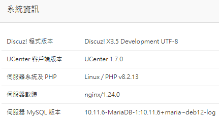

### **簡介** 

Discuz! X 官方 Git (https://gitee.com/Discuz/DiscuzX) ，正體中文 UTF-8 版本

Discuz! X 曾經有以下兩個網站有負責在製作正體中文臺灣地區用語修正版本

[Linux0911](https://web.archive.org/web/20140211120715mp_/http://linux0911.no-ip.info/my_style/discuz_prod/) 
|
[數碼中文坊](https://www.suma.tw/forum-88-1.html)

自從這兩個網站不再維護後，於是本人自行承接來接續維護更新，歡迎取用。

此為 Linux0911 基礎上製作的正體中文臺灣地區用語修正版本。

本倉庫將同步合併 Discuz! X 官方 Git 來進行最新版本更新。

本修正版僅有修改語言翻譯、圖片、CSS 字型為正體中文，新增臺灣地區地理資料，程式碼邏輯相關部份則未修改。

Releases 頁面將僅提供正式版本的打包版，也建議使用。

### **聲明**
您可以 Fork 本站代碼，但未經許可 **禁止** 在本產品的整體或任何部分基礎上以發展任何衍生版本、修改版本或協力廠商版本用於 **重新分發** 

### **DxGit Forker 交流群**
參與本專案 PR 的小夥伴，可以私訊 [@zoewho](https://gitee.com/zoewho) 、[@DiscuzX](https://gitee.com/3dming) 並提供 QQ 號碼進行審核，在審核通過後加入 DxGit Forker QQ 群組與開發者團隊共同交流。

[點選檢視如何提交代碼到本專案](https://gitee.com/Discuz/DiscuzX/wikis/%E6%8F%90%E4%BA%A4%E4%BB%A3%E7%A0%81%E5%88%B0%E6%9C%AC%E9%A1%B9%E7%9B%AE?sort_id=3466289)

### **發佈版下載**
[點選下載發佈版](https://gitee.com/Discuz/DiscuzX/attach_files) 
|
[備用下載地址](https://www.dismall.com/thread-14660-1-1.html)

### **免費協助安裝** 

為方便站長基於 Discuz! X 搭建網站，[Discuz! 應用程式中心](https://addon.dismall.com/) 為站長提供免費安裝 Discuz! X 的服務，詳情諮詢 QQ 1453650

### **安裝、升級指南**
使用發佈版的使用者，查閱安裝包中的 readme.html 檔案，使用碼雲原版的使用者，檢視：[安裝指南](https://gitee.com/Discuz/DiscuzX/wikis/%E5%AE%89%E8%A3%85%E6%95%99%E7%A8%8B?sort_id=3466132)、[升級指南](https://gitee.com/Discuz/DiscuzX/wikis/%E5%8D%87%E7%BA%A7%E6%96%B9%E6%B3%95?sort_id=9978)

### **相關網站**
 
[Discuz! X 官方網站](https://www.discuz.vip/)
|
[Discuz! 交流社群](https://www.dismall.com/)
|
[Discuz! 應用程式中心](https://addon.dismall.com/)
|
[Discuz! 開放平臺](https://open.dismall.com/)
|
[Discuz! 開發檔案](https://open.dismall.com/?ac=document&page=dev)

### **感謝 Fans**

[DiscuzFans](https://gitee.com/sinlody/DiscuzFans)  [DiscuzLite](https://gitee.com/3dming/DiscuzL)

### **每日建構下載**

Discuz! X 提供 3.5 的每日建構，在有提交的第二天早上，可以下載到簡體 UTF-8、繁體 UTF-8 的打包版本。

[點選打開](https://www.discuz.vip/daily/)

### **友情提示**
- Git 版的 Release 版本號不再更新，但[正式版](https://gitee.com/Discuz/DiscuzX/attach_files)會更新
- X3.2、X3.3、X3.4 已停更，無重大漏洞的情況下，將不再更新 X3.4 版本。請隨時關注更新清單，您可進行手動修補，讓自己的網站時刻保持最安全的狀態！
- X3.5 已經於 2023 年 5 月 21 日切換為預設分支

### 截圖
